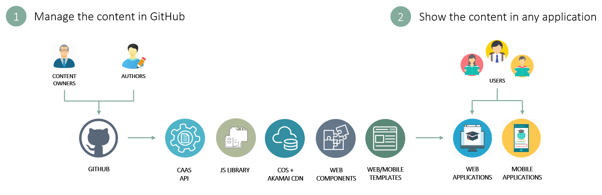

# About DocumentHub

**DocumentHub is a lightweight content management system, which stores the content in GitHub**, in a human friendly format. Content can be managed in GitHub or any other external editor.

DocumentHub is a CMS **tuned for application development**, to help **develop better applications in a shorter time and at lower costs**.

To **speed up the software development**, DocumentHub provides the most common application functionalities which must be implemented in every software application. Instead of re-writing the same functionalities in each new application, they can be quickly reused from DocumentHub.

DocumentHub is also a content sharing platform for authors to license their content to businesses and individuals for use in a wide variety of projects.

### Build applications faster using DocumentHub CMS

- improves performance, security and stability
- reduces development time, costs and risks
- the fastest content search, filter and delivery
- compatible with any web or mobile framework
- lightweight, modern architecture
- changes tracking, history and disaster recovery
- Cloud Object Storage, Akamai CDN

### How it works

