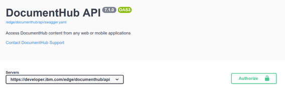
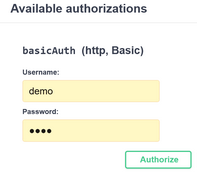
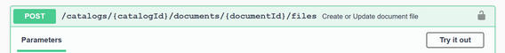
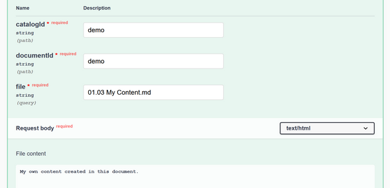
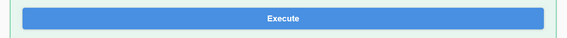

## Get Started

### Use content from GitHub in your website

Embed content from GitHub in your website using DocumentHub Web Components. 

Let's try the Article Web Component and the Document Web Component.

#### Embed an article in a web page

```
    <!DOCTYPE html>
    <html lang="en">
      <head>
        <script 
            type="module" 
            src='https://unpkg.com/documenthub-components@latest/dist/documenthub-components/documenthub-components.esm.js'>
        </script>
      </head>
      <body>
          <documenthub-article
              catalogid="IcCVI6RO"
              documentid="documentation"
              language="en"
              headings="false"
              toc="true"
              token=""
          />
      </body>
    </html>
```

#### Embed a document in a web page

```
    <!DOCTYPE html>
    <html lang="en">
      <head>
        <script 
            type="module" 
            src='https://unpkg.com/documenthub-components@latest/dist/documenthub-components/documenthub-components.esm.js'>
        </script>
      </head>
      <body>
          <documenthub-document
              catalogid="IcCVI6RO"
              documentid="documentation"
              language="en"
              headings="false"
              token=""
          />
     </body>
    </html>
```

#### Make changes to this document by API

1. Access the API
  - open API page: https://developer.ibm.com/edge/documenthub/api
2. Authorize
  - click on the *Authorize* button on the top right of the page  
  
  - enter username: *demo* and password: *demo* and click the *Authorize* button  
  
  - close the Authorize popup
3. Create a document file
  - open create document file endpoint: https://developer.ibm.com/edge/documenthub/api/#/Document%20files/create_document_file_nl
  - click on the *Try it out* button from the right side of the section  
  
  - enter catalogId: *demo*, documentId: *demo* and file: *01.03 My Content.md*
  - in the file content area enter any text  
  
  - click *Execute*  
  
  - the message should be successful
4. Check the new file created in the GitHub repository
  - open the document folder in the GitHub repository: https://github.com/IBM-DocumentHub/Demo-Content-Repository/tree/demo/demo

#### Refresh the webpage and check the changes

Refresh the webpage and check the newly added section.

Add new files or update this file, refresh the webpage and see the changes.


### Manage you own content in GitHub

#### Create a library

#### Create a catalog by forking the example repository

#### Embed your document in a web page

#### Make changes to your document in GitHub

#### Refresh the webpage and check the changes

