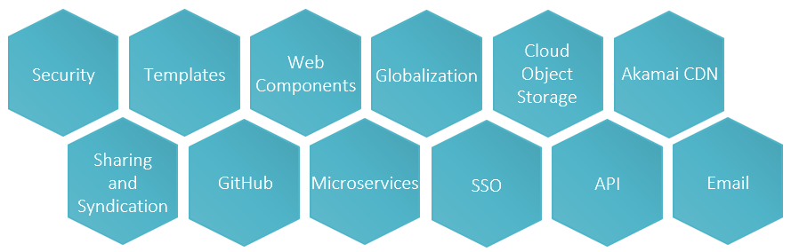
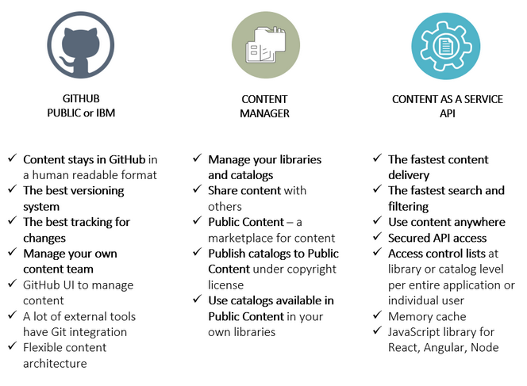
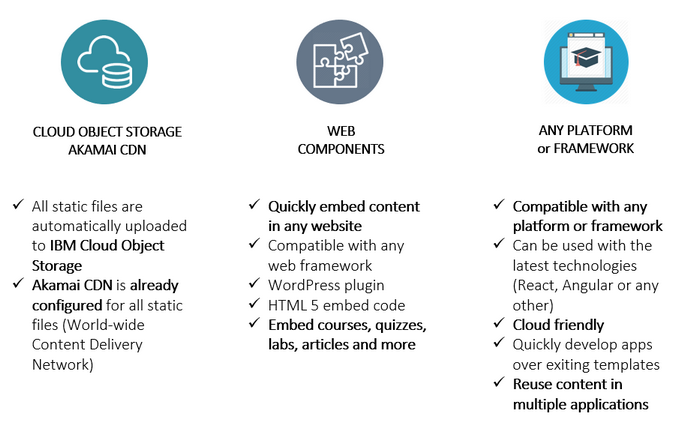

## Why DocumentHub

Applications have almost the same components, but instead of reusing the code, most of the teams rewrite the same components every time, spending a lot of time on development and testing, taking risks and technical challenges.

**DocumentHub saves hundreds of hours of frontend and backend development and solves many risks and technical challenges.**

- the fastest content delivery – 10,000 req/s
- the fastest search – 5x faster than IBM Enterprise Search
- faster development – save hundreds of hours of development
- better applications: performance, security, stability
- reduce risks and technical challenges
- reduce hardware costs by using DocumentHub “as a service”
- compatible with any web or mobile framework
- changes tracking, history and disaster recovery
- Cloud Object Storage, Akamai CDN

### DocumentHub features

#### Content stored in GitHub

- GitHub is the best content versioning system
- benefit of all GitHub features
- content is stored in a human readable format
- use GitHub as an Admin module, already built it
- use any external editor and sync changes with GitHub
- change log, history, differences, revert changes
- make changes in GitHub and they will be immediately available in application
- make changes in application and they will be immediately updated in GitHub
- disaster recovery

#### Search and Filter

- the fastest search engine, 5x faster than IBM Enterprise Search. See a comparison here: https://developer.ibm.com/edge/documenthub/benchmark/enterprise-search-comparison.html
- accurate search for precise results and fuzzy search for finding matches even for a typo
- complex filtering rules
- search, filter, order and pagination in a single request
- returns filters count for easily showing the filter counters in the page
- automatic filtering based on each user access

#### Security

- basic and bearer authorizations
- access control lists
- access control rules
- access control at library, catalog and document levels
- PEN test verified

#### IBMid/w3id SSO

- integration with IBMid and w3id SSO
- SSO implementation in only 2 minutes
- automatic token and cookie management
- stays updated with latest SSO changes without requiring redeploy when IBM SSO is updated

#### Cloud Object Storage

- all attachments are automatically uploaded to IBM Cloud Object Storage

#### Akamai CDN

- all files from Cloud Object Storage are automatically mapped to an Akamai CDN
- caching content in multiple locations over the globe
- automatic image and video optimization for mobile and other low connection devices

#### Web Components

- embed content in web pages using the DocumentHub Web Components
- they can be used for speeding up the development process
- article web component shows a document in a web page in the form of an article
- document web component shows a document in a web page in a browsable view, with a table of contents on the left
- course web component show a document in a web page in a course view, with a table of contents on the left and the completion status of each module
- quiz web component shows a quiz in a web page and communicates the quiz results to a server
- search page web component show a complete search page with search bar, filters, sort, pagination and clickable results in a gird or list view

#### Templates

- templates are applicaton skeletons like React + Carbon + DocumentHub + IBM SSO or Node + DocumentHub + IBM SSO
- they can be used for speeding up the development process

#### Multi-Language

- all documents can have multiple languages

#### API

- very fast API endpoints available

#### Email

- SendGrid account available for sending emails in IBM

#### Faster development

#### Reduce risks and technical challenges

#### Reduce costs with development and hardware

#### Compatible with any web or mobile framework

- DocumentHub is compatible with any web or mobile framework

### More features

