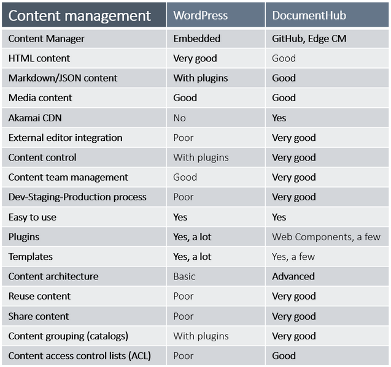
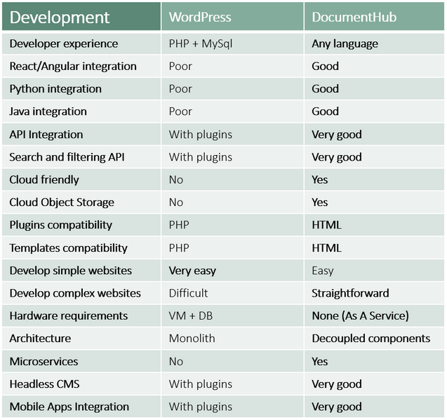

## Why DocumentHub

DocumentHub is a lightweight, modern CMS, created with the latest architecture and technologies and is compatible with the latest frameworks. 

Applications have almost the same components, but instead of reusing the code, most of the teams rewrite the same components every time, spending a lot of time on development and testing, taking risks and technical challenges.

DocumentHub saves hundreds of hours of frontend and backend development, without risks and technical challenges.

- The fastest content delivery – 10,000 req/s
- The fastest search – 4x faster than IBM Enterprise Search
- Faster development – save hundreds of hours of development
- Better applications: performance, security, stability
- No risks or technical challenges
- Reduce hardware costs by using DocumentHub “as a service”

### DocumentHub features

### The fastest search service

DocumentHub has the fastest search and filtering service. See below a comparison with the IBM Enterprise Search - Elastic and Swiftype engines.

### DocumentHub vs WordPress

WordPress dominated the CMS market for so many years, but now developers are rejecting it because of the old technologies.

