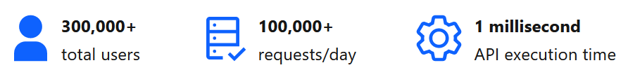

## Who uses DocumentHub

DocumentHub CMS powers many applications cumulating over 300,000 users and 100,000 requests per day.

Some of them are:
- **IBM Products** - ibm.com/products
- **RedHat** - marketplace.redhat.com/en-us/blog
- **Digital Catalyst** - ibm.com/skills/digital-catalyst
- **Partner Showcase** - ibm.com/partners/showcase
- **IBM Demos** - ibm.com/demos
- **Digital Nation** - developer.ibm.com/digitalnation
- **API Hub** - developer.ibm.com/apis
- **Open Labs** - developer.ibm.com/openlabs
