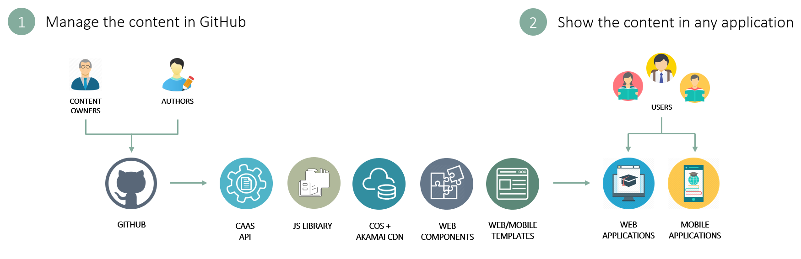
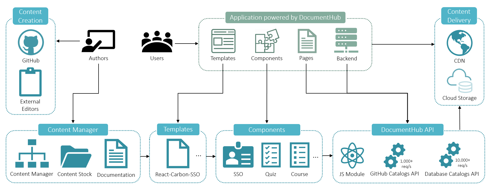
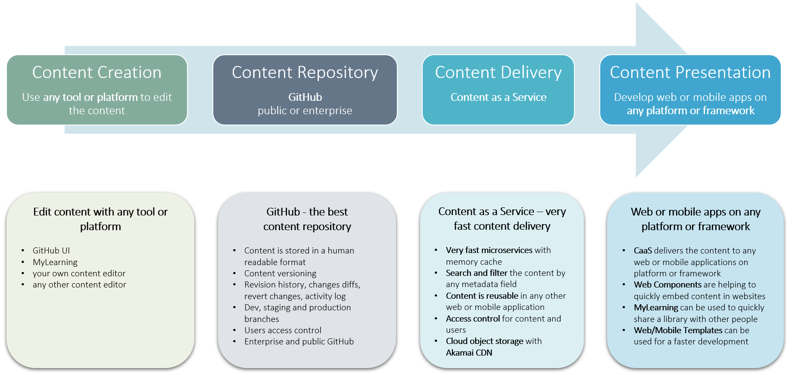
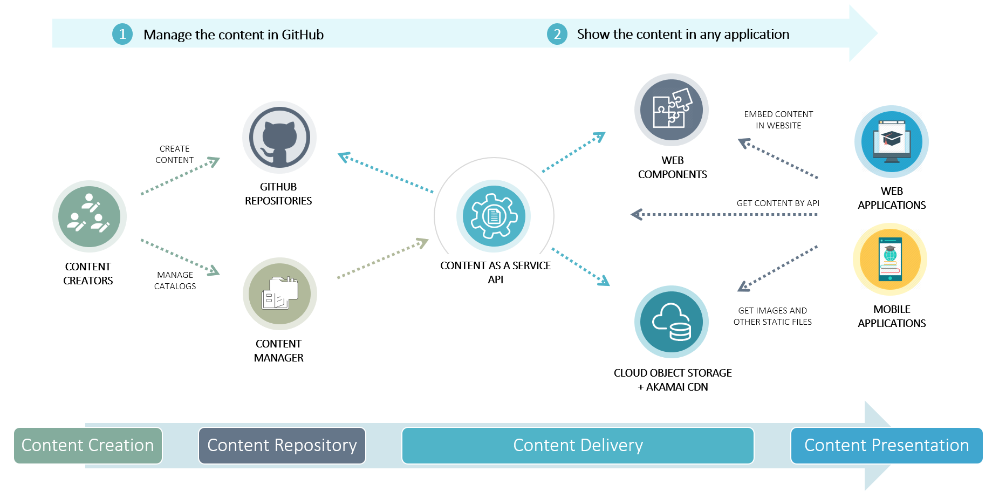

1. Manage the content in GitHub
2. Show the content in any application

## Application powered by DocumentHub

Here is a diagram showing how applications powered by DocumentHub can benefit of all DocumentHub components.

## Decoupled CMS architecture

DocumentHub has a modern, decoupled CMS architecture:

- content can be edited with any tool, editor or platform
- content is stored in GitHub - the best content repository
- it has the fastest content delivery and search services
- it is compatible with any web or mobile application, on any platform or framework

## Content flow, from creation to presentation

