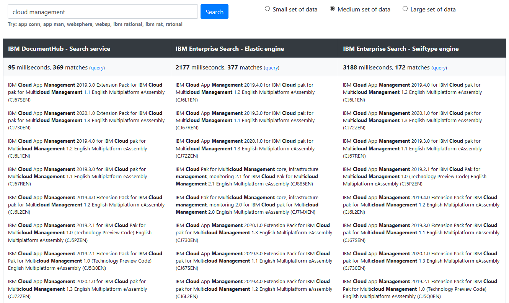
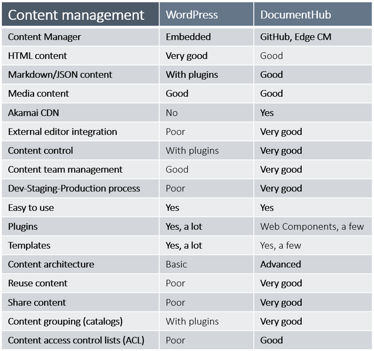
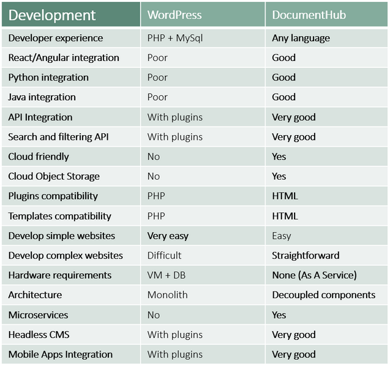

## DocumentHub Search vs IBM Enterprise Search

DocumentHub has the fastest search and filtering service. See below a comparison with the IBM Enterprise Search - Elastic and Swiftype engines.

The results are also more accurate than those returned by the IBM Enterprise Search.

A live comparison can be found here: https://developer.ibm.com/edge/documenthub/benchmark/enterprise-search-comparison.html

## DocumentHub vs NoSql

DocumentHub advantages over a No SQL database:
- JSON files are managed in GitHub which is more friendly than a database UI
- Easy to manage a content team with different roles in GitHub UI
- GitHub UI can be used instead of an admin module in your application
- The content is safe with a very good changes tracking
- Changes history, change differences and it’s easy to revert mistakes
- Dev, staging and production branches for content
- Full text search and filtering by any JSON field
- Cloud Object Storage and Akamai CDN for static files
- Access Control Lists

## DocumentHub vs WordPress

WordPress dominated the CMS market for so many years, but now developers are rejecting it because of the old technologies.

