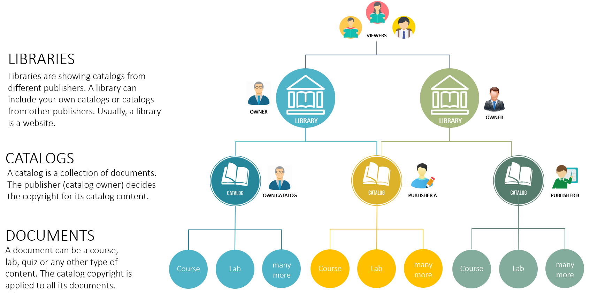
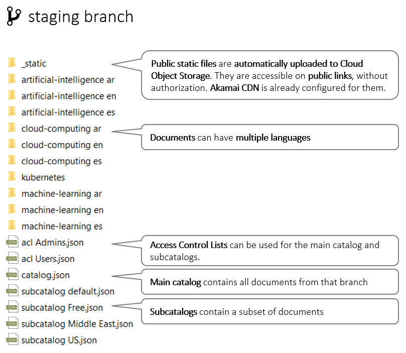
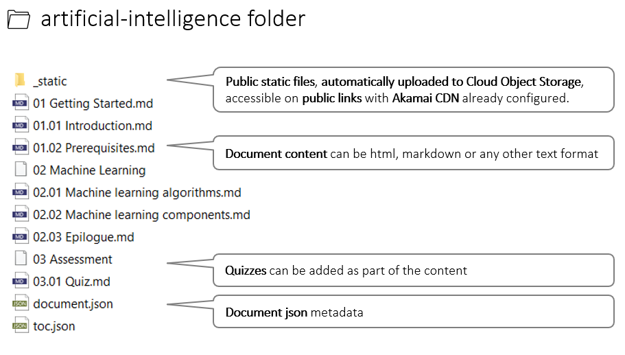
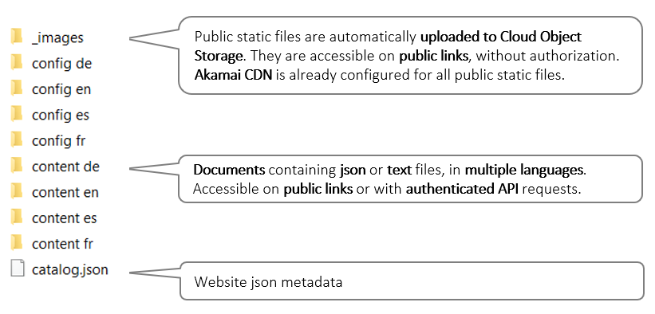
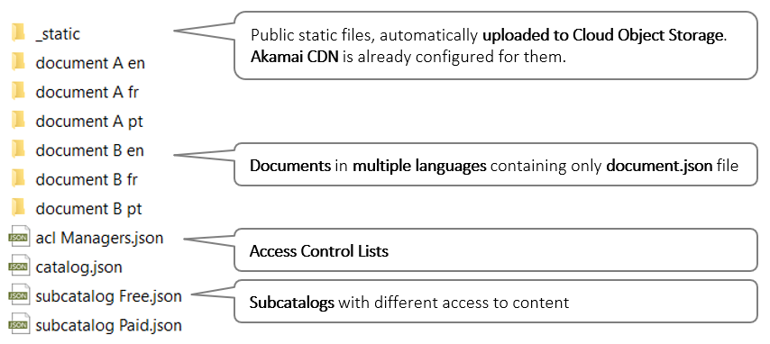

# How is the content organized

# Content examples

## Catalog of documents

## Document

## Website config and content files

Why keeping the website config and content files in a DocumentHub Git catalog:
- easy to be maintained by the content team
- changes are immediately available in the staging or production website
- don't need to redeploy application for every config or text change
- Akamai CDN is already configured for images and any other attachments

## JSON only documents

Why a DocumentHub Git catalog instead of a NoSQL database:
- JSON files are managed in GitHub which is more friendly than a database UI
- easy to create a content team with different roles in GitHub UI
- GitHub UI can be used instead of an admin module in your application
- the content is safe with a very good changes tracking
- changes history, change differences and it’s easy to revert mistakes
- full text search and filtering by any JSON field
- Cloud Object Storage and Akamai CDN for static files
- Access Control Lists
- 1000+ read req/s

Why a DocumentHub database catalog instead of a NoSQL database:
- 10000+ read/write req/s
- full text search and filtering by any JSON field
- Access Control Lists
