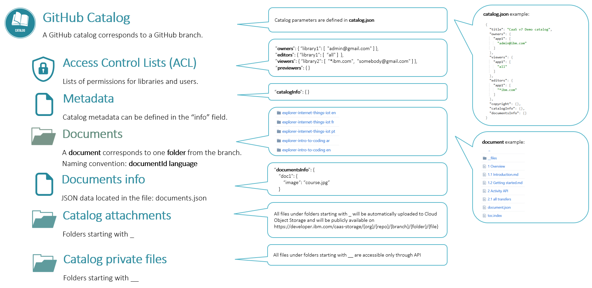

## Catalogs

A catalog is a collection of documents.

There are two types of catalogs: 
- GitHub catalogs
- Database catalogs

GitHub catalogs corresponds to GitHub branches. Database catalogs are stored only in database.

### Version

The default catalog version is 7.

If you want to use the catalog with version 8 API you have to add the version in the catalog.json:
```
  "version": 8
```

### Catalog structure




Naming conventions:
- catalog public attachments folder - any folder starting with _ (underscore) in the branch root
- catalog private files folder - any folder starting with __ (two underscores) in the branch root
- documents info, at the catalog level - documentsInfo field in the catalog.json file
- document - folder in the branch root named as {documentid}[space]{language}
  - language is optional. If missing it will be set to NA
- document metadata - document.json file in the document folder
- document public attachments folder - any folder starting with _ (underscore) in the document folder
- document private files folder - any folder starting with __ (two underscores) in the document folder
- files and folders starting with . (dot) are ignored


### Metadata

Catalog metadata is defined in the catalog.json file, in the "info" field, like this:

```
  "info": {
    ...
  }
```

### Attachments

Folders starting with _ (underscore) are considered public attachments folders.

All files found in the public attachments folders are uploaded to **Cloud Object Storage**. **Akamai CDN** is already configured for all public attachments.

#### Version 7 catalogs

The files path to Cloud Object Storage will be:
- Catalog attachments
  - CDN: https://dw1.s81c.com/caas-storage/{gitorg}/{gitrepo}/{gitbranch}/{attachmentsfolder}/{filename}
  - no cache: https://developer.ibm.com/caas-storage/{gitorg}/{gitrepo}/{gitbranch}/{attachmentsfolder}/{filename}
- Document attachments
  - CDN: https://dw1.s81c.com/caas-storage/{gitorg}/{gitrepo}/{gitbranch}/{documentid}/{lang}/{attachmentsfolder}/{filename}
  - no cache: https://developer.ibm.com/caas-storage/{gitorg}/{gitrepo}/{gitbranch}/{documentid}/{lang}/{attachmentsfolder}/{filename}

Examples:
- https://dw1.s81c.com/caas-storage/skillscollection/demo/preview/_attachments/nature_compressed.jpg
- https://dw1.s81c.com/caas-storage/skillscollection/demo/preview/devops/en/_attachments/nature.jpg

If you want to hide the git location from the attachments url, you can replace it with the catalog id by adding this line in the catalog.json:
```
  "attachmentsBaseFolder": "{catalogId}"
```


#### Version 8 catalogs

The files path to Cloud Object Storage will be:
- Catalog attachments
  - CDN: https://dw1.s81c.com/caas-storage/{catalogId}/{attachmentsfolder}/{filename}
  - no cache: https://developer.ibm.com/caas-storage/{catalogId}/{attachmentsfolder}/{filename}
- Document attachments
  - CDN: https://dw1.s81c.com/caas-storage/{catalogId}/{documentid}/{lang}/{attachmentsfolder}/{filename}
  - no cache: https://developer.ibm.com/caas-storage/{catalogId}/{documentid}/{lang}/{attachmentsfolder}/{filename}


Do not hardcode the attachments base path in the application. This is returned in all catalogs and documents json responses in the attachmentsBaseUrl and cdnAttachmentsBaseUrl fields.


### Private files

Folders starting with __ (two underscores) are private attachments folders.

Files from the private attachments folders can be downloaded only with authorized API requests.


### Access control

There are five access fields:
- owners - can view and update catalog and documents
- creators - can create documents
- editors - can view catalog and documents and can create and update documents
- viewers - can view catalog and documents
- previewers - can view catalog and documents metadata

Access control at the catalog level can be defined, like this:

```
{
  ...
  "owners": [
    "library1": ["john@doe.com", "acl admins"]
  ],
  "creators": [
    "library2": ["all"]
  ],
  "editors": [
    "library2": ["john@rambo.com", "*ibm.com", "{document.author}"]
  ],
  "viewers": [
    "library2": ["all"]
  ]
  "previewers": []
}
```

In the example above:
- users john@doe.com and those listed in acl admins, from library1, are catalog owners
- all users can create documents
- users john@rambo.com, all users under ibm.com domain, and the user defined in document.author field, from library2, are document editors
- all users form library2 are viewers
- no one has preview access

The access fields are visible only for catalog owners.

If an access field is missing or empty then is considered that no one has that level of access.

An access field contains a set of libraries and for each library a list of users, which can have one of the following values:
- an user id - "john@doe.com"
- a pattern - "*ibm.com"
- an acl file - "acl admins"
- a field from the document - "{document.author}"
- "all" - which means all users from that library have access

