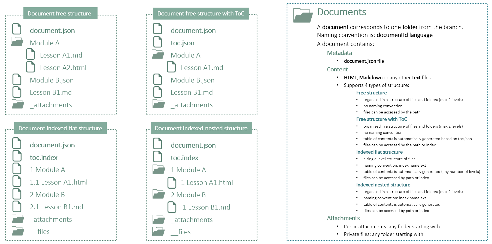

## Documents

A document can be an article, a course, lab, quiz or any other type of content.


Documents:
- are defined as folders in a branch
- folder naming convention is: documentid language (e.g. blockchain-fundamentals en, explorer-cloud ar, explorer-cloud en)
- language is optional. If missing it will be set as NA
- they contain metadata, content, public attachments, private files and access control rules
- metadata is defined in document.json or document.yaml file
- public attachments are defined in any folder starting with underscore (e.g. _files, _attachments)
- private attachments are defined in any folder starting with two underscores (e.g. __files, __quiz)
- files starting with dot (.) are ignored
- any other file is considered part of the document contents


In the folders and files name is recommended to avoid illegal characters from Windows OS:
  - leading and trailing spaces
  - `/ \ | < > ? * % : " ^`


### Metadata

Metadata is provided as json or yaml.

There are two levels of metadata: 
  - document metadata at the document level
  - document custom metadata at the catalog level

Document metadata defined inside the document:
  - are defined in a file named document.json inside the document folder
  - can contain any metadata in json format (e.g. {"title":"Artificial Intelligence", "language":"en", "status":"Approved"} )

Document metadata defined at the catalog level:
  - are defined in catalog.json in the documentsInfo field
  - can contain any metadata in json format associated with a documentId (e.g. {"cloud": {"topic": "cloud", "journey": "explorer"} )


### Content


### Table of contents


### Attachments


### Private files


### Access control

Access control at the document level can be defined like this:

```
{
  "document": {
  },
  ...
  "access": {
    "owners": [
      "library1": ["john@doe.com"]
    ],
    "viewers": [
      "library1": ["all"]
    ]
  }
```

The access field is visible only for document owners.
If the access field is missing then the same read/write access from the catalog is applied also for the document.


### Document structure



