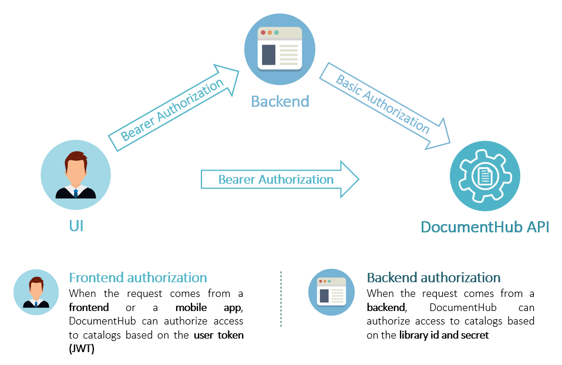

## Library Access Control

### Authorization

DocumentHub authorization is done at library level.

There are 2 type of authorization:
- Basic authorization
  - can be done only with library ID and no user: LibraryId:Secret
  - or with library ID and user ID: LibraryId/UserId:Secret
- Bearer authorization
  - contains both library ID and user ID

