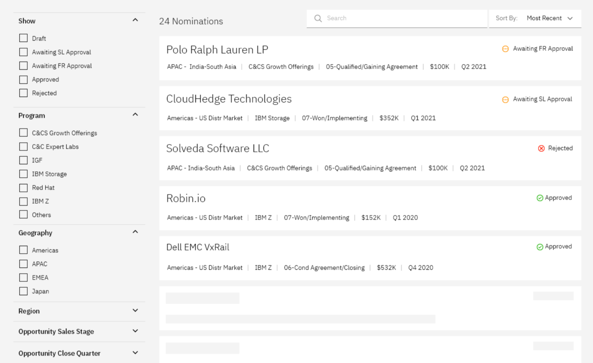

# Web Components

DocumentHub Web Components can be used to quickly embed content into web pages. They can be used in React or in any other web application by directly embedding the HTML.

- **Search Page** component - a full search page with search bar, filters with counters, sort, pagination and results displayed as a list of a grid
- **Article** component - a document shown as an article
- **Document** component - a document shown with the table of content on the left
- **Form** editor component - an form generated based on the catalog schema, which read/write data to document.json or another json file
- **Quiz** component - a fully functional quiz, rendered according to a quiz json file
- **Course** component - a fully functional course, with progress tracking and quizzes integration
- **Page** component - show a document as a html page


## Content Authorization

If the ```caasToken``` cookie is present, the components will use it automatically. Otherwise the authorization is done based on the token provided in component params list.

Catalogs which allow access to "all" libraries and users, can be accessed without authorization (```"viewers": ["all": ["all"]]```).


## How to load web components


### HTML

```
<link rel="stylesheet" href="https://unpkg.com/documenthub-web-components@latest/dist/lib/index.css">
<script 
    type="module" 
    src='https://unpkg.com/documenthub-web-components@latest/dist/lib/index.js'>
</script>
```


### React

Install the documenthub-web-components package:

```
npm i documenthub-web-components
```

Import documenthub-components:

```
import { Article, ... } from 'documenthub-web-components'
```


## Search Page component

Search page component renders a full search page to easly search through DocumentHub's content and display it ease.



### How to use

Include this code in your page:

```
<documenthub-searchpage 
    catalogid="your-catalog-id" 
    documenthref="link-to-document-page"
    columns="1"
    template=""
    header=""
    table=""
    token="your-auth-token"
    resultsLabel=""
    noResultsMessage=""
    collapsedFilters=""
    showEmptyFilters=""
/>
```

- catalogid is the catalog in which the component will run the search
- documenthref is the link where the component will redirect when the user clicks a result (I.E https://hostname/document/{documentid}/{language}).
  The following variables can be used in the documenthref URL:
    - {catalogid}
    - {documentid}
    - {language}
- columns is the number of columns used for displaying results
- template is the html template for customizing results
- table is used instead of template if you want a table format for results
- token is required only if you don't have the caasToken cookie set

#### Optional parameters
- resultsLabel - custom name for results in places like the title, example: 'resultsLabel="Nomination"' will display '20 Nominations' in the app; default 'Result'
- noResultsMessage - custom message for 0 results displayed
- collapsedFilters - by default all filter categories are expanded; this parameter accepts a list of filters that will pe collapsed by defaul, in list format, with key values separated by ",", example: 'collapsedFilters=document.status,document.name"'
- showEmptyFilters - "showEmptyFilters='false'" hides filters with 0 results

### Examples

```
<documenthub-searchpage
    catalogid="FTxRp9KK"
/>
```

```
<documenthub-searchpage
    catalogid="FTxRp9KK"
    table="{"headers":["Title", "Cost"], "data":["document.title", "document.cost"]}"
/>
```

```
<documenthub-searchpage
    catalogid="FTxRp9KK"
    header="<div><div>Title</div><div>Cost</div></div>"
    template="<div><div>{document.title}</div><div>{document.cost}</div></div>"
/>
```


## Article component

Article component shows a document in a web page in the form of an article - all contents shown in a long, single page. Optionally it can show the table of contents in the begining of the article.

### How to use in React

```
<Article
	catalogid="your-catalog-id",
	documentid="document-id",
	language="en",
	headings="true/false",
	token="aaa.bbb.ccc"
/>
```

### How to use in HTML

```
<documenthub-article
    catalogid="your-catalog-id"
    documentid="your-document-id"
    language="your-document-language"
    headings="true/false"
    token="your-auth-token"
/>
```
        
- catalogid points to the catalog from which the document will be loaded
- documentid points to the document to be displayed
- language is the language of the document you want to display
- headings specify if the headings will be automatically displayed based on the module name
- token is required only if you don't have the caasToken cookie set

### Example

```
<link rel="stylesheet" href="https://unpkg.com/documenthub-web-components@latest/dist/lib/index.css">
<script 
    type="module" 
    src='https://unpkg.com/documenthub-web-components@latest/dist/lib/index.js'>
</script>

<documenthub-article
    catalogid="IcCVI6RO"
    documentid="documentation"
    language="en"
    headings="false"
/>
```


## Document component

Document component shows a document in a web page, one module at a time. The table of contents is shown on the left side and one module content at a time, on the rest of the page. 

### How to use in React

```
<Document
	catalogid="your-catalog-id",
	documentid="document-id",
	language="en",
	headings="true/false",
	token="aaa.bbb.ccc"
/>
```

### How to use in HTML

Include this code in your page:
```
<documenthub-document
    catalogid="your-catalog-id"
    documentid="your-document-id"
    language="your-document-language"
    headings="true/false"
    token="your-auth-token"
/>
```

- catalogid points to the catalog from which the document will be loaded
- documentid points to the document to be displayed
- language is the language of the document you want to display
- headings specify if the headings will be automatically displayed based on the module name
- token is required only if you don't have the caasToken cookie set

### Example

```
<documenthub-document
    catalogid="IcCVI6RO"
    documentid="documentation"
    language="en"
    headings="false"
/>
```


## Edit Form Component

Document edit component provides a solution to edit one document at a time, there are two possible ways:
- as a form, if the provided catalog has an existing ```schema``` object
- under the form of a ```textarea``` which takes the input as a JSON. 

See a **document schema example** here: https://github.com/IBM-DocumentHub/ContentRepository-Demo/blob/main/catalog.json

### How to use

Include this code in your page:

```
<documenthub-edit
    catalogid="your-catalog-id"
    documentid="your-document-id"
    language="your-document-language"
    token="your-auth-token"
/>
```

- catalogid points to the catalog from which the document will be loaded
- documentid points to the document to be edited
- language is the language of the document you want to edit
- token is required only if you don't have the caasToken cookie set


### Example

```
<script 
    type="module" 
    src='https://unpkg.com/documenthub-components@latest/dist/documenthub-components/documenthub-components.esm.js'>
</script>

<documenthub-edit
    catalogid="demo"
    documentid="test"
    language="en"
   token="your-auth-token"
/>
```


## Quiz component

Quiz component shows a quiz in a web page along with the complete functionality.

### How to use in React

```
<Quiz
	catalogid="your-catalog-id",
	documentid="document-id",
	language="en",
	token="aaa.bbb.ccc"
/>
```

### How to use in HTML

```
<documenthub-quiz
    catalogid="your-catalog-id"
    documentid="your-document-id"
    language="your-document-language"
    token="your-auth-token"
/>
```
        
- catalogid - points to the catalog from which the document will be loaded
- documentid - points to the document which contains the quiz
- language (optional) - is the language of the document which contains the quiz,
- token (optional) - is required only if you don't have the caasToken cookie set


### Example

```
<documenthub-quiz
    catalogid="001"
    documentid="html-test"
    language="en"
/>
```

## Page component

Page component shows a document as a HTML page

### How to use in React

```
<Page
	catalogid="your-catalog-id",
	documentid="document-id",
	token="aaa.bbb.ccc"
/>
```

### How to use in HTML

```
<documenthub-page
    catalogid="your-catalog-id"
    documentid="your-document-id"
    token="your-auth-token"
/>
```
        
- catalogid - points to the catalog from which the document will be loaded
- documentid - points to the document which contains the quiz
- token (optional) - is required only if you don't have the caasToken cookie set


### Example

```
<documenthub-page
    catalogid="008"
    documentid="page"
    token="your-auth-token"
/>
```
## Course component

...
