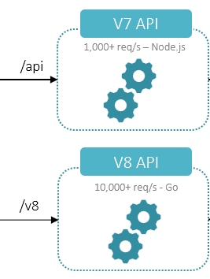

# DocumentHub API

DocumentHub API is a lightweight set of microservices, using memory cache to offer the **fastest delivery** of the content. This content delivery mechanism is also known as **Content as a Service**.

There are 2 versions available:
- **version 7**
  - Read: 1000+ req/s, Write: 1-100 req/s
  - API Doc: https://developer.ibm.com/edge/documenthub/api
- **version 8**
  - For now it's limited to database catalogs only
  - Read: 10000+ req/s, Write: 10000+ req/s
  - API Doc: https://developer.ibm.com/edge/documenthub/v8

