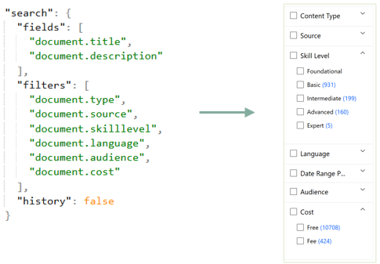
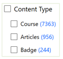

### Search API

#### Search Initialization

Search initialization json can be defined in catalog.json or can be set with /searchinit API.
Init config is saved in the catalog so you have to call it again only when there are changes. 

Example of search initialization in catalog.json:

```
catalog.json
{
  ...
  "search": {
    "fields": [
      "document.title"
    ],
    "filters": [
      "document.category"
    ]
  }
}
```




#### Search History

Returns the list of all searches ran on this catalog.


#### Simple Search

Search text in the metadata fields defined in search initialization. Returns the matching documents in the relevance order.


#### Advanced Search

Search, filter, sort, pagination and filters count in a single API request. All fields are optional.

```
{
  "search": "ibm",
  "filter": {
    "or": {},
    "and": {
      "document.language": "en",
      "document.type": [
        "course",
        "article"
      ],
      "document.cost": {
        "gt": 0,
        "lte": 1000
      }
    }
  },
  "sort": {},
  "limit": {
    "from": 0,
    "to": 99
  },
  "returnFiltersCount": false,
  "returnFields": [
    "document",
    "catalog"
  ]
}
```

This is search "ibm" in all documents than filters the document by:
```
language="en" and (document.type="course" or document.type="article") and (document.cost>0 and document.cost<=1000)
```

If sort is missing, the default sort is by relevance.

Only the results from 0 to 99 are returned.


#### Search Suggestions

Search text in the metadata fields defined at search initialization. Returns the search suggestions based on the user input so far.


#### Filters Count

Returns the list of all values for each filter field defined in search initialization, along with the count for each value.


